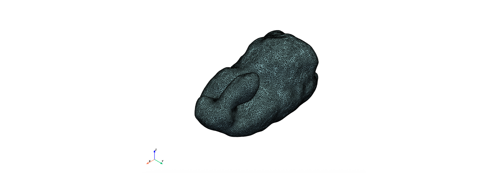
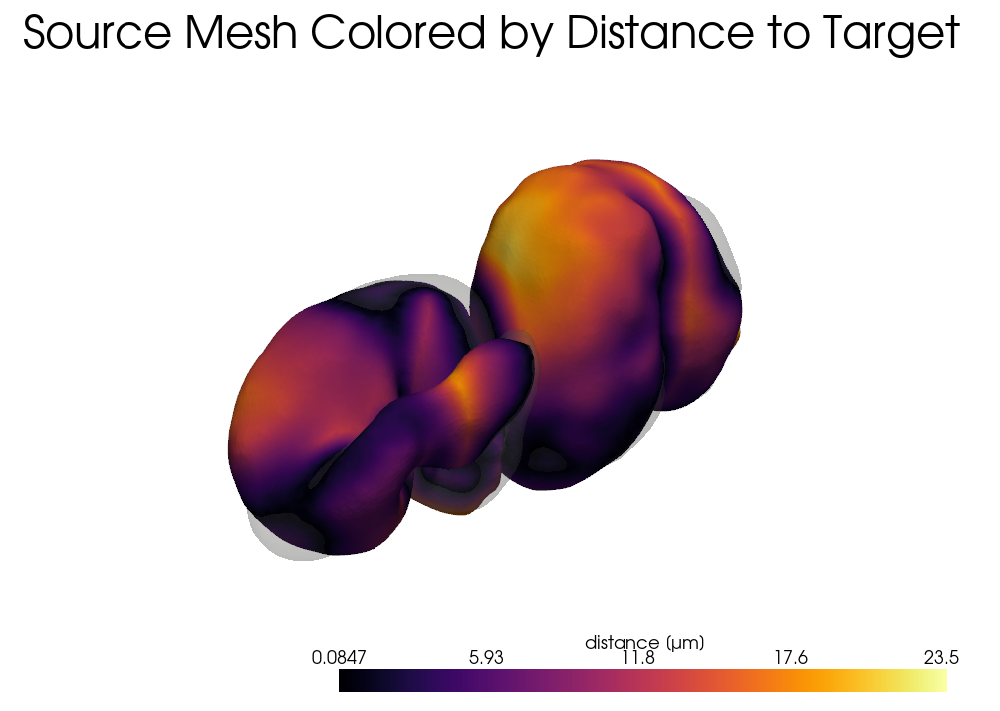
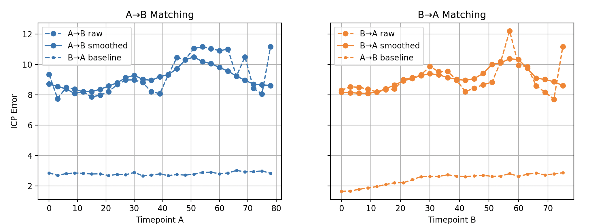
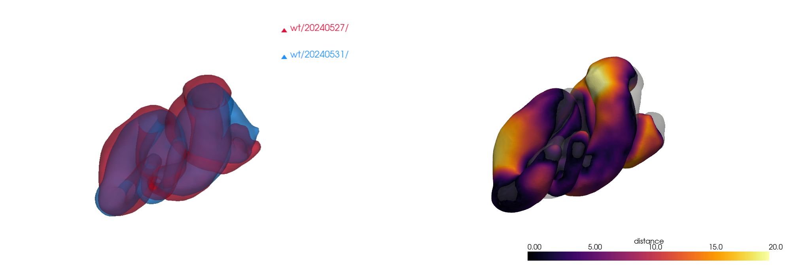

# Mesh Triangulations for Biological Shape Analysis

# Part 1: Intro to python and mesh triangulations

This tutorial introduces some core concepts in scientific 
programming and shape analysis using Python. We'll explore 
how to represent, manipulate, and compare 2D and 3D shapes 
using triangulated meshes, with a focus on biological 
applications. You will learn how to build meshes from scratch, 
analyze them for correctness, and register two shapes using 
Iterative Closest Point (ICP) alignment. 
The notebook is intended for early-stage graduate students with no serious coding experience. 

___
## 0. Getting Started 

### 0a. Pycharm
To begin working with Python code, we recommend using PyCharm, a free, user-friendly code editor. 
First, download PyCharm Community Edition and install it on your computer following the instructions here:
`https://www.jetbrains.com/help/pycharm/installation-guide.html`. When you open PyCharm 
for the first time, create a new project: choose the folder where this tutorial's code resides, and copy the 
`wildtype` and `bynGAL4_UASMyo1C` data to that same folder (see Figure 1). 

Then configure a Python interpreter. Select or create an interpreter that uses Python 3.10 — 
this version is required for the tutorials in this course. If no interpreter is available, click 
“Add Interpreter” and choose a Virtualenv, then select Python 3.10 
as the base interpreter during setup (you may need to install it, see Figure 1).
If you are experienced with python, feel free to use a Conda Environment and create a base interpreter 
from python 3.10. 
Once your project is open, open organ_geometry.py. At the top, some of the modules will be underlined in red since they are not installed.
Hover over one and click `Install all missing packages` (see Figure 1). Then close organ_geometry.py and open the
Python Console using the top icon in the bottom left (see Figure 2).
Now you can copy-paste snippets of code into the Python Console to run them (note the copy icon circled in Figure 2).
If you see an error like ModuleNotFoundError for any reason while playing with the code, click the red light 
bulb or go to Settings > Python Interpreter to install the missing package 
(or use conda install <package-name> in the terminal if you are using a Conda environment). 
That’s it — you’re ready to start coding in Python!

*Note:* For Conda users, there is a .yml file included that will load up your virtual environment 
with what you need with:
```
$ conda env create -f environment.yml
```


*Figure 1: Setting up in PyCharm.*


*Figure 2: Running this module in PyCharm.*

### 0a. Python
Python provides several core data structures that are widely used in both everyday scripting and advanced scientific workflows. Understanding their characteristics will help you choose the right tool for the job and write clearer, more efficient code.

We will work with the following fundamental data structures:

- **Lists**  
  Lists are ordered, mutable collections of elements. They can hold elements of different types, and are typically used for sequential data or collections you plan to modify.  
  _Example_: `mylist = [3.2, "gut", 5]`

- **Tuples**  
  Tuples are like lists, but immutable. This means their contents cannot be changed after creation. Tuples are useful for representing fixed-size records or coordinates.  
  _Example_: `coords = (1.0, 2.0, 3.0)`

- **Dictionaries**  
  Dictionaries store key-value pairs. They are ideal for associating labels or identifiers with values, like mapping timepoints to filenames or experimental conditions to measurements.  
  _Example_: `mydict = {"wt": "20240527", "oe": "20240626"}`

- **Arrays (from NumPy)**  
  NumPy arrays are powerful containers for numerical data. Unlike lists, they support efficient mathematical operations and are used heavily in scientific computing, especially for vectors, matrices, and multidimensional datasets.  
  _Example_: `arr = np.array([[1, 2], [3, 4]])`

Throughout this module, we’ll use these data structures to work with 2D and 3D triangulated meshes, align shapes across space and time, and track shape variations of a model organ.

## 0c. The embryonic fly midgut

During development, tissues integrate mechanical and biochemical signals to drive 
organ-scale geometric transformations. 
Left-right symmetry breaking is a fundamental feature of organ morphogenesis 
that is crucial for function. 
While left-right asymmetric genetic patterning of the early embryonic body plan 
can trickle down to influence organ scale asymmetries, there is also a role for 
cell-intrinsic processes: cells themselves break left-right symmetry through cytoskeletal activity. 
Remarkably, tuning the concentration of certain molecular motors such as members
of the unconventional myosin 1 protein family can invert organ chirality across 
vertebrates and invertebrates alike, but we currently lack a physical 
understanding of the tissue-scale forces that drive organ-scale chirality. 
One direction in the Mitchell Lab aims to uncover the mechanical forces that
drive organ asymmetry and relate them to cell-intrinsic activity of Myo1C.
Here in this tutorial, we'll look at the chiral shape dynamics of the
*Drosophila* midgut as a model system. 
We will ask: to what extent are the guts of wild-type and embryos with myosin 1C overexpression mirror images of one another?

The data you are working with was taken from live, multiview lightsheet microscopy imaging of 
the midgut across ~2.5 hrs of development.
We used computer vision tools (Mitchell & Cislo, 2023) to extract the tissue surface over time.
Here you are presented with these mesh triangulations. 


*Figure 3: Multiview lightsheet imaging and computer vision tools enable analysis of chiral shape changes in gut morphogenesis.*

## 1. Setup and Imports

Before we begin, we import the necessary Python libraries for 3D geometry processing, visualization, and numerical operations.
Each of these libraries is a module.
Note that you can write your own modules and import them, as long as they are placed somewhere that python can find them (ex in the current working directory or installed globally).
As an example, we import the Mesh class from mesh.py, which is included in this tutorial.

If any of these other statements return an error, simply install the required module into your virtual environment in PyCharm (or on terminal if you have a Conda environment).

If we `import moduleName`, then we can access functions or classes defined in `moduleName` by calling `moduleName.functionName(args)` or `moduleName.className()`. 

If we `import moduleName as localName`, then we can access functions or classes defined in `moduleName` by calling `localName.functionName(args)` or `localName.className()`. 

If we say `from moduleName import functionName/className`, then we can access the desired function or class by calling `functionName(args)` or `className()`. 

```python
import numpy as np              # powerful N-dimensional array operations
import matplotlib.pyplot as plt # for 2D and 3D plotting
from mpl_toolkits.mplot3d.art3d import Poly3DCollection  # 3D triangle plotting
import pyvista as pv            # easier 3D mesh visualization
from mesh import Mesh           # custom class for watertightness and normal checks
import open3d as o3d            # registration and mesh manipulation
from scipy.spatial import cKDTree  # nearest neighbor search
import copy                     # for duplicating objects safely
```

___

## 2. Understanding Triangulations

A **triangulation** is a way of approximating a surface using flat triangles. In biological imaging, shapes like organs or tissues are often reconstructed into triangle meshes. Here, we begin with simple examples to understand the data structures used to describe them.

A mesh consists of:
- a **list of vertices** (points in 2D or 3D space, stored as a NumPy array)
- a **list of faces** (which connect 3 or more vertex indices to form polygons)

### 2a. An example triangulation: the Stanford Bunny

Let's first learn by example. We read in a PLY file of the Stanford Bunny, provided by the Stanford Computer Graphics Laboratory.
```python
m = pv.read('bunny.ply')
print(m)
m.plot(show_edges=True)
```


*Figure 4: The Stanford bunny as a mesh triangulation, composed of vertices and faces.*
 
How is this defined? It has vertices and faces. A face connects three vertices. 
Because the faces are triangles, this is a *triangulation*.

Open up `bunny.ply` in a text editor. See how it has vertices and faces defined. 

### 2b. A Single Triangle
This is the simplest mesh, made of 3 points and 1 triangle.
Here `x` and `y` are NumPy arrays and `faces` is a Python list of vertex index triplets.

```python
x = np.array([0, 1, 0])         # x-coordinates of the vertices
y = np.array([0, 0, 1])         # y-coordinates
faces = [[0, 1, 2]]             # one triangle made from those three points

# Plotting in python: use matplotlib.pyplot
# Let's make lines that connect the vertices.
# Concept check: Why do we have to index into faces?
plt.figure()
plt.plot(x[faces[0]], y[faces[0]], '-')
plt.title('single triangle...almost')
plt.axis('equal')
plt.show()
```
Coding concept check: why is there a missing edge in the plot?
```python
# Go all the way around!
face = faces[0]
plt.figure()
plt.plot(np.append(x[face], x[face[0]]), np.append(y[face], y[face[0]]), '-o')
plt.title('A Single Triangle')
plt.axis('equal')
plt.show()
```

Coding concept check: do you understand what appending the 0th element does above?


We can also do this with triplot():
```python
plt.figure()
plt.triplot(x, y, faces, color='black')
plt.plot(x, y, 'o', color='blue')  # plot the points as dots
plt.title('A Single Triangle')
plt.axis('equal')
plt.show()
```


*Figure 5: A single triangle plotted using `triplot`.*

### 2c. A Triangulated Square
We build a square from two triangles.
```python
x = np.array([0, 1, 0, 1])      # 4 corner points of a square
y = np.array([0, 0, 1, 1])
faces = [[0, 1, 2], [1, 3, 2]]  # two triangles

plt.figure()
plt.triplot(x, y, faces, color='black')
plt.plot(x, y, 'o', color='blue')
plt.title('2D Triangulation of a Square')
plt.axis('equal')
plt.show()
```


*Figure 2: A square composed of two triangles.*

### 2d. A Triangulated Cube in 3D
Now we move to 3D, building a cube from 8 corner points and 12 triangles.
Can you build this yourself?

```python
vertices = np.array([
    [0, 0, 0],  # 0
    [1, 0, 0],  # 1
    [1, 1, 0],  # 2
    [0, 1, 0],  # 3
    [0, 0, 1],  # 4
    [1, 0, 1],  # 5
    [1, 1, 1],  # 6
    [0, 1, 1]   # 7
])

# Define faces (two per face, 12 faces total)
faces = [
    [0, 2, 1], [0, 3, 2],  # bottom face
    [4, 5, 6], [4, 6, 7],  # top face
    [0, 1, 5], [0, 5, 4],  # front face
    [2, 3, 7], [2, 7, 6],  # back face
    [0, 7, 3], [0, 4, 7],  # left face
    ?????? <Fill in here>   # right face
]


fig = plt.figure()
ax = fig.add_subplot(111, projection='3d')
tri_faces = [[vertices[i] for i in tri] for tri in faces]  # list of 3D triangles
ax.add_collection3d(Poly3DCollection(tri_faces, facecolors='cyan', edgecolors='black', alpha=0.8))
ax.scatter(vertices[:,0], vertices[:,1], vertices[:,2], color='blue')

# Set labels
ax.set_xlabel('X')
ax.set_ylabel('Y')
ax.set_zlabel('Z')

# Set equal aspect ratio
ax.set_box_aspect([1, 1, 1])
plt.title('3D Triangulation of a Cube')
plt.show()
```
Try moving it around.

*Figure 6: Triangulated cube from 8 vertices and 12 triangles.*


___

## 3. Mesh Validation

Before doing analysis or alignment, we often must ensure that the mesh is well-formed:
- **Watertightness**: no missing connections or open edges.
- **Consistent Orientation**: all face normals point outward.

### 3a. Watertightness Check
Let's count how many times each edge appears. If watertight, it should appear twice. 
This demo highlights the use of dictionaries.

```python

# Initialize an empty dictionary to count edges
edge_count = {}

# Loop over all faces
for tri in faces:
    # Extract edges from the triangle
    edges = [
        (min(tri[0], tri[1]), max(tri[0], tri[1])),
        (min(tri[1], tri[2]), max(tri[1], tri[2])),
        (min(tri[2], tri[0]), max(tri[2], tri[0]))
    ]

    # Count how many times each edge appears
    for edge in edges:
        if edge in edge_count:
            edge_count[edge] += 1
        else:
            edge_count[edge] = 1

# Collect edges that appear < 2 or > 2 times (open or non-manifold edges)
open_edges = []
for edge in edge_count:
    if edge_count[edge] != 2:
        open_edges.append((edge, edge_count[edge]))

# Report
if len(open_edges) == 0:
    print("The mesh is closed (watertight).")
else:
    print("The mesh is NOT closed. Problematic edges:")
    for edge, count in open_edges:
        print(f"  Edge {edge} appears {count} times")
```
Concept check: why did we use min() and max() in the definition of edges?


### 3b. Face Orientation (somewhat advanced)
Recall that the order of a triangle matters: the order of vertex indices listed for a triangle determines which way is "in" or "out" in 3D.
Here we do a simple check for whether the faces of the cube are pointing the right way. 
Let's use dot products to check if face normals point away from the mesh center. 
A dot product measures the amount of alignment between two vectors. 
If the face's "normal" direction (ie its "outward" direction) is pointing in a similar direction as the vector pointing from the origin to the face, then the dot product will be positive. 
If the face is oriented the wrong way, then the dot product is negative. 


```python

# Compute cube center
center = np.mean(vertices, axis=0)

def is_outward_facing(tri):
    v0, v1, v2 = vertices[tri[0]], vertices[tri[1]], vertices[tri[2]]
    # Compute normal vector
    normal = np.cross(v1 - v0, v2 - v0)
    # Vector from the center of the triangle to center of the cube
    tri_center = (v0 + v1 + v2) / 3
    from_center = tri_center - center 
    # Dot product tells us if the normal is pointing toward or away from the center
    return np.dot(normal, from_center) > 0  # Should be negative if pointing outward

# Check all faces
inward_facing = []
for i, tri in enumerate(faces):
    if not is_outward_facing(tri):
        inward_facing.append(i)

# Report
if len(inward_facing) == 0:
    print("All faces are consistently outward-facing.")
else:
    print("Found inward-facing faces at indices:")
    print(inward_facing)
```
Concept check: This works for a cube. Would it work for a more complex shape? Provide a simple example that fails, and verify this with code.


## 3c. Advanced checks
Challenge: how does this check work? At the least, make sure you can follow 
the structure: we use the `Mesh` class imported from mesh.py. The class has a *method* called `is_closed`. 
A method is like a function that belongs to a class. The class instance `mm` executes the method `is_closed()` when we say `mm.is_closed()`, effectively asking itself, 'Am I closed?'
```python
mm = Mesh(vertices, faces)
mm.is_closed()

# To fix face orientations using Mesh() class, do the following:
mm.make_normals()
mm.force_z_normal(direction=1)
```

___

## 4. Loading meshes from microscopy data

We can now load some experimentally-derived 3D triangle meshes — for example, segmentations from a microscopy dataset of the *Drosophila* gut.
We've saved the mesh as a `.ply` file. Take a look at the PLY file in a text editor. 
Note that all the information about the contents are in the header. First the vertices are listed, then the faces. The header declares what information is in the file, how many vertices, how many faces, etc.


Below we use the `pyvista.PolyData` class to provide convenient 3D plotting for meshes. You can use the more standard `matplotlib.pyplot` functions too, but they are going to be laggy for meshes of this size (or if you don't have enough RAM, they will make your python console freeze up).


```python
m = pv.read('./wt/20240527/mesh_000000_APDV_um.ply')  # returns a PyVista mesh object
m.plot(show_edges=True)
```


*Figure 7: Example mesh from level sets and Poisson disk surface reconstruction.*

___

## 5. Shape Matching Using ICP

The **Iterative Closest Point (ICP)** algorithm finds the rigid transform (rotation + translation) that best aligns two point clouds or meshes.


### 5a. Generate and Offset Meshes

Let's load a couple of meshes -- two guts from different embryos at a similar developmental stages. 
We load these as `TriangleMesh` class instances from Open3D, but don't let that scare you: they are just containers for vertices and faces.
We then compute the optimal translation and rotation that best matches one mesh to the other one. 
I packaged this optimization in a function in `organ_geometry.py`.

```python
from organ_geometry import align_mesh_icp, color_mesh_by_distance

ssfactor = 10 # subsampling factor (take 1/N points for the ICP registration).
              # Larger values will run faster but be less precise. This is for speedup

print('Reading in meshes...')
fA = "wildtype/20240527/mesh_000040_APDV_um.ply"
meshA = pv.read(fA)

fB = "wildtype/20240531/mesh_000050_APDV_um.ply"
meshB = pv.read(fB)

# Align one mesh to the other
meshA_t, T = align_mesh_icp(meshA, meshB, ssfactor=ssfactor)

```

*Figure 8: Two different embryos' midguts, captured at a similar stage of development, aligned in space.*

Here `T` is a 4×4 NumPy array representing the optimal rigid transform.
Advanced concept check: how are data stored inside `T`? Hint: There is a matrix encoding rotations and scaling, but also a translation (dx, dy, dz). Which columns/rows are which? 

### 5c. Compute and Color Distance
We measure how close the aligned mesh is to the target and color it by the distance from the nearest matching point.
```python
# Color the mesh by distance between the two
color_mesh_by_distance(meshA_t, meshB, transform=None)
```


*Figure 9: The Euclidean distance between two gut meshes.*

Under the hood, in another function I put in `organ_geometry.py`, we computed the distance to the nearest meshB vertex for each vertex in meshA.
Then we converted those distances to a color array, a NumPy array with shape `(N, 3)` for RGB values.
How does your alignment look?


### 5d. Generate and Offset Meshes
The guts we've been looking at are from a wildtype embryo with three different fluorescent markers (full genotype is *w, HandGFP / w; UAS-mCh:CAAX / +;bynGAL4, klar / H2A-iRFP*. 
Let's compare to the gut of an embryo that overexpresses Myosin1C (full genotype is *w, HandGFP / w; UAS-Myo1C:RFP / +;bynGAL4, klar / H2A-iRFP*).
In this case, the unconventional myosin motor acts in a portion of the digestive tract (the *byn* domain) to invert the chiral shape dynamics.

How similar are these two organ morphologies?

Let's first compare them directly.

```python
print('Reading in meshes...')
fA = "wildtype/20240527/mesh_000050_APDV_um.ply"
meshA = pv.read(fA)

fB = "bynGAL4_UASMyo1C/20240528/mesh_000052_APDV_um.ply"
meshB = pv.read(fB)

# Align one mesh to the other
meshA_t, T = align_mesh_icp(meshA, meshB, ssfactor=ssfactor, Alabel="WT", Blabel='byn>Myo1C')

# Color the mesh by distance between the two
dists, plotter = color_mesh_by_distance(meshA_t, meshB, transform=None)
plotter.show()
```

*Figure 10: Overexpression of Myo1C dramatically changes the gut shape.*


Now let's flip one across the left-right axis and compare them again. 

```python
# Now flip y -> -y in the Myo1C OE case
meshA = pv.read(fA)
meshB = pv.read(fB)
meshB.points[:, 1] *= -1

# Align one mesh to the other
meshA_t, T = align_mesh_icp(meshA, meshB, ssfactor=ssfactor, Alabel="WT", Blabel='byn>Myo1C, mirrored')

# Color the mesh by distance between the two
dists, plotter = color_mesh_by_distance(meshA_t, meshB, transform=None)
plotter.show()
```


*Figure 11: Overexpression of Myo1C nearly mirrors (inverts along the left-right axis) the gut shape.
Pronounced residual mismatch is visible in the anterior chamber (arrowhead).*


# Part 2: Timepoint Alignment and Spatiotemporal Comparison

This second part builds on our introductory ICP module to analyze time-series data from a developing embryonic gut in WT conditions and with Myo1C overexpression. We align shapes over time, compare shape dynamics between experimental conditions, and visualize mismatch using point cloud alignment. This module assumes that triangulated mesh files (`.ply`) are already segmented from microscopy and stored in directories corresponding to timepoints.


___

## 6. Setup and Parameters

We begin by importing libraries and setting parameters. These include which experimental conditions we want to compare (`wt`, `oe`, etc.) and how much to subsample meshes for faster computation.

```python
from organ_geometry import *
import pandas as pd
import numpy as np
import os

# Main parameters
step = 7          # downsampling step in timepoints
ssfactor = 10      # spatial subsampling factor for ICP
conditions = ['wt', 'oe', 'x1', 'x2', 'x3', 'x4']  # comparison pairs
wt_oe = 'wt'
outdir = 'results'
```

___

## 7. Timepoint Matching with ICP

This section performs pairwise shape comparison using ICP to align all meshes from `dirA` to those in `dirB`. ICP produces a matrix of matching errors, which we smooth and use to infer a time-mapping between the two datasets.

```python
# Collect all PLY files and extract their timepoint numbers
filesA = natsorted([f for f in os.listdir(dirA) if f.endswith(".ply")])[::step]
filesB = natsorted([f for f in os.listdir(dirB) if f.endswith(".ply")])[::step]
tpsA = np.array([extract_tp(f) for f in filesA])
tpsB = np.array([extract_tp(f) for f in filesB])

# Run ICP and match timepoints using dynamic time warping
icp_raw = build_icp_cost_matrix(dirA, dirB, ssfactor, step, flipy)
icp_smooth = smooth_icp_matrix(icp_raw)
AtoB, BtoA = match_timepoints(icp_smooth)
path, _, _ = dtw_match(icp_smooth)
path = np.array(path)
path_tps = np.array([tpsA[path[:,0]], tpsB[path[:,1]]]).T
```

___

## 8. Visualizing Timepoint Matching

Plot the smoothed ICP error matrix, with the dynamic time warping path overlayed in red. This helps visualize which timepoints from A match which timepoints from B.

```python
plt.imshow(icp_smooth, cmap='inferno')
plt.plot(path[:,1], path[:,0], 'r.-')
plt.title("Timepoint Alignment (DTW)")
plt.xlabel("Time B")
plt.ylabel("Time A")
plt.colorbar(label="ICP Error")
plt.tight_layout()
plt.show()
```


*Figure 12: Smoothed root-mean-squared error measurements after ICP alignment for two different WT datasets.
The paths represent AtoB alignment (blue), BtoA alignment (orange), and the result of a simple dynamic time warping implementation (purple).*


*Figure 13: The average root-mean-squared mismatch at each timepoint along the AtoB and BtoA paths show that cross-shape variation rises slightly over time.*


___

## 9. Expected ICP Error from Subsampling

We estimate the smallest error we can expect from subsampling, based on average spacing between points. This gives a baseline to interpret ICP error values.

```python
mean_spacing_A = [mean_point_spacing(pv.read(os.path.join(dirA, f)).points[::ssfactor]) for f in filesA]
mean_spacing_B = [mean_point_spacing(pv.read(os.path.join(dirB, f)).points[::ssfactor]) for f in filesB]
expected_rmse_A = np.array(mean_spacing_A) / np.sqrt(2)
expected_rmse_B = np.array(mean_spacing_B) / np.sqrt(2)
```

*Figure 14: The expected baseline ICP error from finite sampling of the meshes lies far below the measured values.*


___

## 10. Visualize Aligned Meshes

This section loads a matching pair of meshes, runs ICP alignment, and overlays them to assess alignment quality. We apply a pre-alignment translation to center the shapes.

```python
# Pick one timepoint to visualize
tp2view = int(np.median(tpsA))
tidx = np.argmin(np.abs(tpsA - tp2view))
meshA = pv.read(os.path.join(dirA, filesA[tidx]))
meshB = pv.read(os.path.join(dirB, filesB[AtoB[tidx]]))

# Align and overlay
vA = meshA.points[::ssfactor]; vB = meshB.points[::ssfactor]
shift = vB.mean(0) - vA.mean(0)
meshA_t = meshA.translate(shift, inplace=False)
T, _ = compute_icp_transform_o3d(vA + shift, vB)
meshA_t.transform(T, inplace=True)

plotter = pv.Plotter()
plotter.add_mesh(meshA_t, color='crimson', opacity=0.6)
plotter.add_mesh(meshB, color='dodgerblue', opacity=0.6)
plotter.show()
```


*Figure 15: Spatial alignment of two WT midguts at an example timepoint.*


___

## 11. Measuring the spatial pattern of misalignment between samples

### 11a. Distance coloring
Let's now color a midgut mesh by how far away it is from the mesh in the 
other sample at the matched timepoint.

```python
# --------------------------------------
# Color by distance between the two
# --------------------------------------
# Load meshes
tp2view = int(np.median(tpsA))
tidx = np.argmin(np.abs(tpsA - tp2view))

meshA = pv.read(os.path.join(dirA, filesA[tidx]))
meshB = pv.read(os.path.join(dirB, filesB[AtoB[tidx]]))

# Subsample point clouds for ICP
vA = meshA.points[::ssfactor]
vB = meshB.points[::ssfactor]
centroid_shift = vB.mean(axis=0) - vA.mean(axis=0)
meshA_t = meshA.translate(centroid_shift, inplace=False)
vA += centroid_shift

# ICP transform and application
T, _ = compute_icp_transform_o3d(vA, vB)
meshA_t.transform(T, inplace=True)

# Show distance coloring
color_mesh_by_distance(meshA_t, meshB, transform=None)
```

*Figure 16: Distance of one mesh from another at an example matched timepoint.*


### 11b. Batch Distance Coloring and Export

We loop over all timepoints and visualize distance between each aligned mesh pair. The color intensity shows how well two shapes match locally.

```python
xyzlim = compute_global_bounds(dirA, dirB, filesA, filesB)
batch_icp_overlay(dirA, dirB, filesA, filesB, AtoB, outdir=f"icp_overlay_{wt_oe}",
                  ssfactor=ssfactor, xyzlim=xyzlim, flipy=flipy)

batch_color_by_distance(dirA, dirB, filesA, filesB, AtoB,
                        outdir=f"colored_distance_{wt_oe}",
                        ssfactor=ssfactor, xyzlim=xyzlim, flipy=flipy, clim=(0, 20))
```

___

## 12. Final Export

We can use a `pandas` dataFrame for saving the result. This is like a table and we save 
the data as a csv. 

```python
# Save the results
icpRawA = icp_raw[np.arange(len(tpsA)), AtoB]
icpSmoothA = icp_smooth[np.arange(len(tpsA)), AtoB]
icpRawB = icp_raw[BtoA, np.arange(len(tpsB))]
icpSmoothB = icp_smooth[BtoA, np.arange(len(tpsB))]
df_icp = pd.DataFrame({
    "tpsA": tpsA,
    "AtoB": AtoB,
    "icpRawA": icpRawA,
    "icpSmoothA": icpSmoothA
})

df_icp_B = pd.DataFrame({
    "tpsB": tpsB,
    "BtoA": BtoA,
    "icpRawB": icpRawB,
    "icpSmoothB": icpSmoothB
})

df_icp.to_csv(f"icp_error_AtoB_{wt_oe}_step{step}_ss{ssfactor}.csv", index=False)
df_icp_B.to_csv(f"icp_error_BtoA_{wt_oe}_step{step}_ss{ssfactor}.csv", index=False)
```

You can save numeric results as `.npy` arrays for further analysis. These files store ICP matrices, expected noise floors, and timepoint mappings.

```python
np.save(f"icp_raw_{wt_oe}.npy", icp_raw)
np.save(f"icp_smooth_{wt_oe}.npy", icp_smooth)
np.save(f"expected_rmse_A_{wt_oe}.npy", expected_rmse_A)
np.save(f"expected_rmse_B_{wt_oe}.npy", expected_rmse_B)
np.save(f"path_{wt_oe}.npy", [path, path_tps])
```

___

## 13. Cross-Condition Comparison

Run the above for different conditions `'wt', 'oe', 'x1', 'x2', 'x3', 'x4'`. 
We compare how ICP errors change across conditions. This can reveal if shape dynamics differ significantly between WT and perturbed embryos.

Note that whitespace matters in python. Just as delimiters like spaces or punctuation in English can completely change the meaning of a sentence — for example, “Let’s eat, Grandma” vs. “Let’s eat Grandma” — Python relies on whitespace, punctuation, and syntax to interpret code correctly.

```python

for i, wt_oe in enumerate(conditions):
    if wt_oe == 'wt':
        # dirA = "HandGFPbynGAL4klar_UASmChCAAXHiFP/20240527/"
        # dirB = "HandGFPbynGAL4klar_UASmChCAAXHiFP/20240531/"
        dirA = "wt/20240527/"
        dirB = "wt/20240531/"
        flipy = False
    elif wt_oe == 'oe':
        dirA = "oe/20240528/"
        dirB = "oe/20240626/"
        flipy = False
    elif wt_oe == 'x1':
        dirA = "wt/20240527/"
        dirB = "oe/20240528/"
        flipy = True
    elif wt_oe == 'x2':
        dirA = "wt/20240527/"
        dirB = "oe/20240626/"
        flipy = True
    elif wt_oe == 'x3':
        dirA = "wt/20240531/"
        dirB = "oe/20240528/"
        flipy = True
    elif wt_oe == 'x4':
        dirA = "wt/20240531/"
        dirB = "oe/20240626/"
        flipy = True
    ...
    # All the batch analysis you ran above here
    ...


conds = ['wt', 'oe', 'x1', 'x2', 'x3', 'x4']
icp_dict = {}
for cond in conds:
    df = pd.read_csv(f"icp_error_AtoB_{cond}_step{step}_ss{ssfactor}.csv")
    icp_dict[cond] = {"tps": df["tpsA"].values, "error": df["icpSmoothA"].values}

# Interpolate onto common timepoints
tps = np.intersect1d(icp_dict['wt']['tps'], icp_dict['oe']['tps'])
for d in icp_dict.values():
    m = np.isin(d["tps"], tps)
    d["tps"], d["error"] = d["tps"][m], d["error"][m]

# Compare
wt_err, oe_err = icp_dict['wt']['error'], icp_dict['oe']['error']
x_errs = np.stack([icp_dict[f"x{i}"]["error"] for i in range(1,5)])

plt.plot(tps, wt_err, 'b.-', label='WT<->WT')
plt.plot(tps, oe_err, 'r.-', label='OE<->OE')
plt.plot(tps, x_errs.mean(0), 'k-', label='WT<->OE')
plt.fill_between(tps, x_errs.mean(0)-x_errs.std(0), x_errs.mean(0)+x_errs.std(0), color='gray', alpha=0.3)
plt.title("ICP Matching Error Across Conditions")
plt.xlabel("Timepoint")
plt.ylabel("RMSE")
plt.grid(True)
plt.legend()
plt.tight_layout()
plt.show()
```


*Figure 17: Comparing the distance between mesh pairs within and across groups (with the Myo1C OE case inverted L<->R).*

This figure provides a quantitative summary of dynamic shape variability under genetic or experimental perturbation. How do you interpret these results?


___

## Next Steps

- Try aligning real meshes from your experiments
- Explore ICP variants (e.g., point-to-plane)
- Add mesh preprocessing: smoothing, simplification, hole filling
- Analyze biological trends in alignment error
